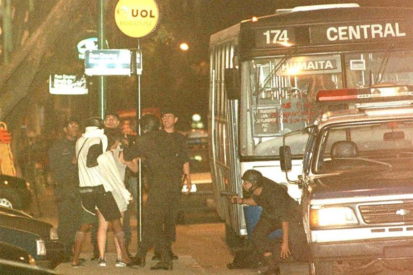

# "O Rio de Janeiro, Fevereiro e Março..." - Análise da Violência no Rio de Janeiro

  

 

O Rio de Janeiro possui várias facetas, como toda grande cidade, e a que chama atenção do resto do Brasil é a da criminalidade que assola o estado. A percepção da violência no RJ é pauta de noticiários diariamente, também já vem sendo retratada em vários filmes e séries em diversas épocas, o que nos faz entender que não é um problema recente, mas sim um que possui uma evolução histórica até os dias atuais.

Este projeto de Análise Exploratória de Dados vai pegar os dados disponibilizados pelo instituto de segurança pública do Estado do Rio de janeiro, buscando entender como essa evolução da violência se comportou nas últimas décadas, para extrair informações que possam ajudar as autoridades competentes a resolver alguns desses problemas.

Como dito no Jornal El País em 2018: "O Rio não é um caso perdido e a violência tem sim solução"
